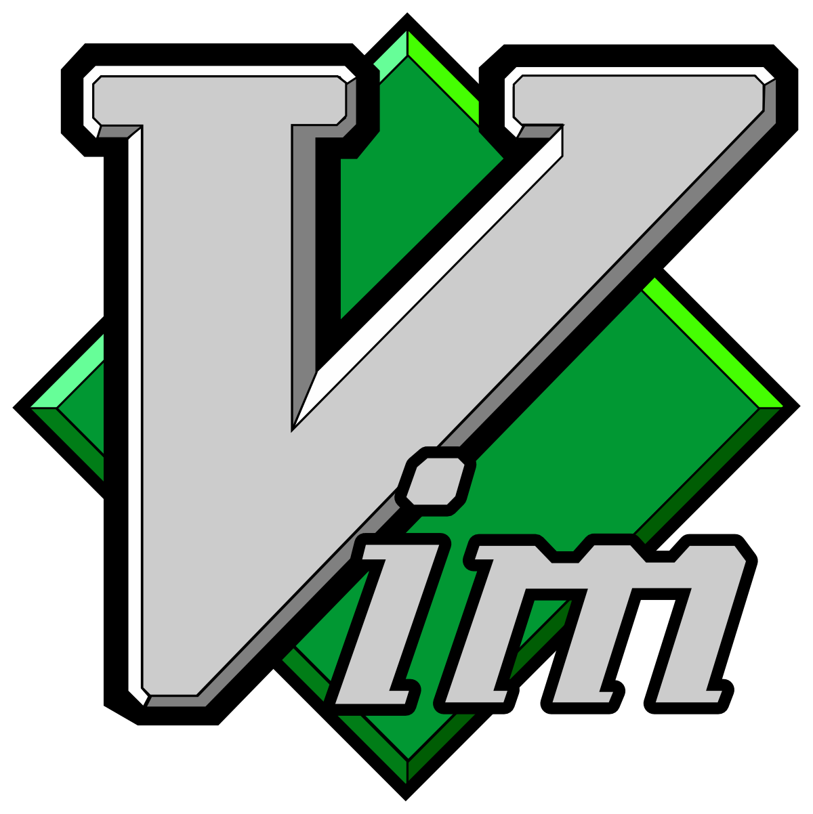
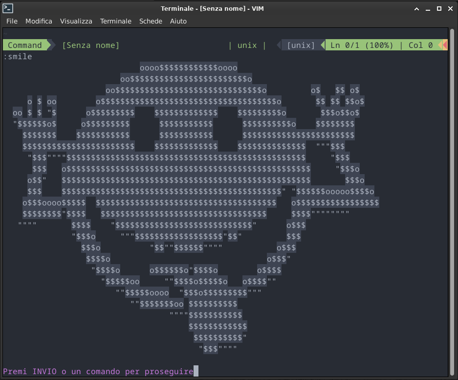
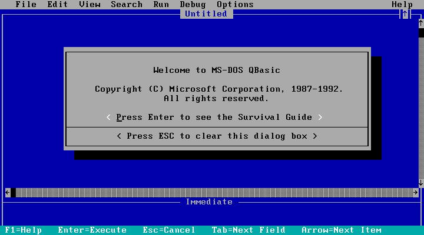

# .vimrc

Dear developers, IT professionals, and system administrators worldwide, this is my semi-final version of the `.vimrc` file, and I want to share it with everyone.

**Ah... I have disabled the ALE and Copilot plugins at startup. They are very convenient, but I find them quite intrusive, so I enable them only when needed or necessary.**

You can enable them manually with the following commands (I prefer enable them when needed):
:ALEEnable | ALEDisable
:Copilot enable | disable

### Introduction

I have worked on this file for many years, in a rather disorganized and experimental way. I started using Debian in the winter of 1999, and since then, I have experimented with many editors for both fun and work. For a long time, I used Emacs, but for the past 24 years, I have exclusively used ViM. I barely remember the Emacs commands now, although I have promised myself to revisit it someday – old friends should not be abandoned.

My goal was to have a fast and versatile editor, suitable for both software development and configuration file editing on Linux and Unix systems. I wanted a visually appealing workspace, with features such as autocomplete and auto-correction, along with all the modern conveniences like integration with Large Language Models for automated comment generation.

After testing numerous plugins and configurations, I finally arrived at a `.vimrc` version that fully satisfies me. I chose the `One Dark` theme for its clarity, but I also installed a nostalgic theme that transforms ViM into a version inspired by the old QBasic – a tribute to the 90s, although less comfortable for everyday use.

The goal of this configuration is to have a powerful and customizable editor capable of meeting the needs of:

- **Developers**: with support for C, C++, Python, HTML, CSS, and JavaScript.
- **System Administrators**: for quick and comfortable editing of configuration files on Linux and macOS systems.
- **Github and Copilot**: 

I revised this configuration to overcome some issues with `YouCompleteMe` on Debian 12 stable and to make it even more complete and versatile.

> **Note:** A future TODO is to integrate OmniSharp and plugins for Unity3D, but for game development, I have fully embraced Godot and prefer to use its environment for GDscript.

## TODO

- Integrate OmniSharp for Unity3D support.
- Add specific configurations to enhance the Godot experience.

## License

This project is licensed under the [MIT License](https://opensource.org/licenses/MIT). Anyone is free to improve this configuration and, if they wish, credit me as the original author.

## How to Contribute

Feel free to clone this repository, experiment, and propose changes:

1. Fork the project.
2. Create a branch for your modifications.
3. Submit a pull request with a clear description of the improvements.

Thank you for reading this guide! I hope it proves helpful and inspires you to customize your own ViM editor.
